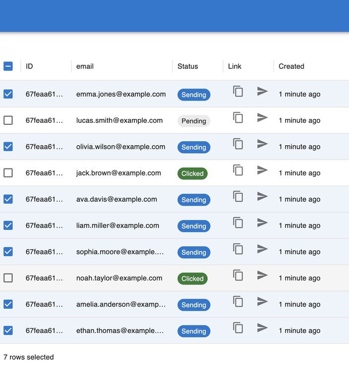

# Phishing simulator

## Installation

```sh
cp .env.dist ./.env
docker compose up
```
NOTE: it should work, but you can try to restart.

IMPORTANT (!): The connection to internet is required for nodemailer API.

### In the browser:

[http://localhost:3001/register](http://localhost:3001/register)

### Steps:

* Create user & login
* Create "add emails" for bulk creation to populate table
* Next use "bulk send" and you will see the how kafka sending emails using simulation backend
* Click on copy icon to copy the phishing link and paste in the browser. You should see the changing status in table

## Emails seeds:
```txt
emma.jones@example.com,lucas.smith@example.com,olivia.wilson@example.com,jack.brown@example.com,ava.davis@example.com,liam.miller@example.com,sophia.moore@example.com,noah.taylor@example.com,amelia.anderson@example.com,ethan.thomas@example.com,harper.jackson@example.com,mason.white@example.com
```

## Bonus
Kafka monitor:
    [http://localhost:8080](http://localhost:8080)



