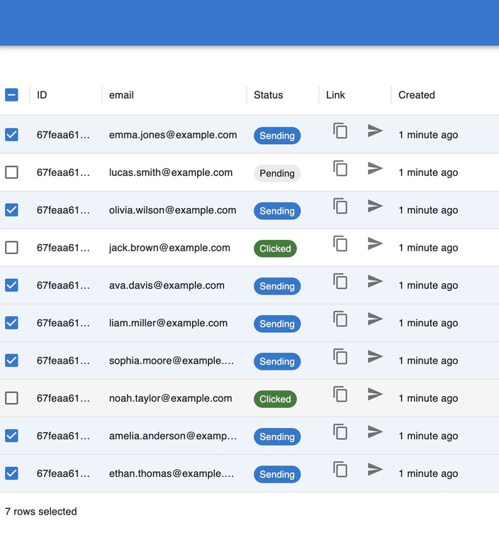

# Phishing simulator

## Installation

```sh
cp .env.dist ./.env
docker compose up
```
NOTE: it should work, but you can try to restart.

IMPORTANT (!): The connection to internet is required for nodemailer API.

### In the browser:

[http://localhost:3001/register](http://localhost:3001/register)

### Steps:

* Create user & login
* Create "add emails" for bulk creation to populate table
* Next use "bulk send" and you will see the how kafka sending emails using simulation backend
* Click on copy icon to copy the phishing link and paste in the browser. You should see the changing status in table

## Nx Commands

This is an Nx monorepo. Use Nx CLI for all commands:

```bash
# Frontend
npx nx build frontend      # Build
npx nx lint frontend       # Lint
npx nx typecheck frontend  # Type check
npx nx test frontend       # Test
npx nx serve frontend      # Dev server (port 4200)

# Backend (management)
npx nx build management    # Build
npx nx lint management     # Lint
npx nx test management     # Test
npx nx serve management    # Dev server

# Run all lints
npx nx run-many -t lint

# Run all builds
npx nx run-many -t build
```


## CI/CD

### GitHub Actions

The frontend CI workflow (`.github/workflows/frontend.yml`) runs on push/PR to `main` and `develop`:

- **Lint**: ESLint checks
- **Typecheck**: TypeScript type checking
- **Build**: Vite production build

Path filters: Only runs when `apps/frontend/`, `libs/`, or config files change.

### Deployment

- **Frontend**: Deployed as Render Static Site (auto-deploy on push to `main`)
- **Backend**: Deployed as Render Web Service (auto-deploy on push to `main`)
- **Infrastructure**: Managed via Terraform in the `infra` repo

## Emails seeds:
```txt
emma.jones@example.com,lucas.smith@example.com,olivia.wilson@example.com,jack.brown@example.com,ava.davis@example.com,liam.miller@example.com,sophia.moore@example.com,noah.taylor@example.com,amelia.anderson@example.com,ethan.thomas@example.com,harper.jackson@example.com,mason.white@example.com
```

## Bonus
Kafka monitor:
    [http://localhost:8080](http://localhost:8080)



